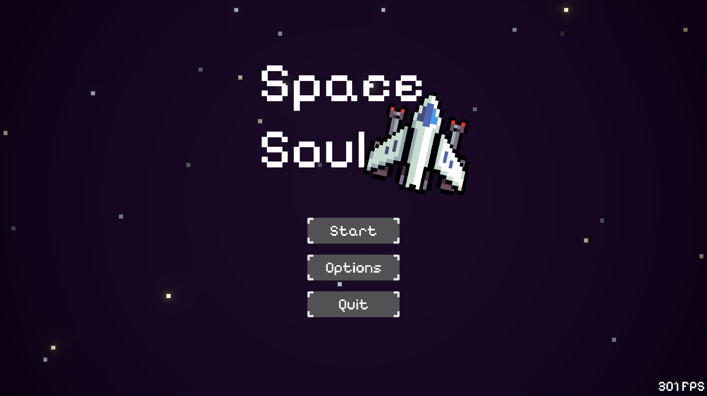
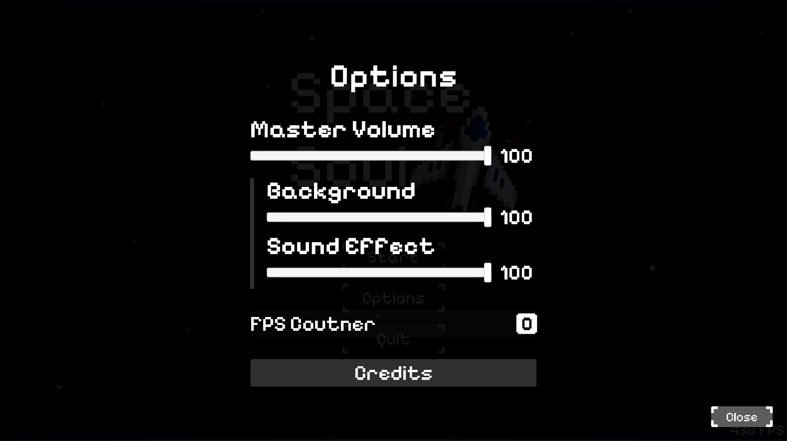
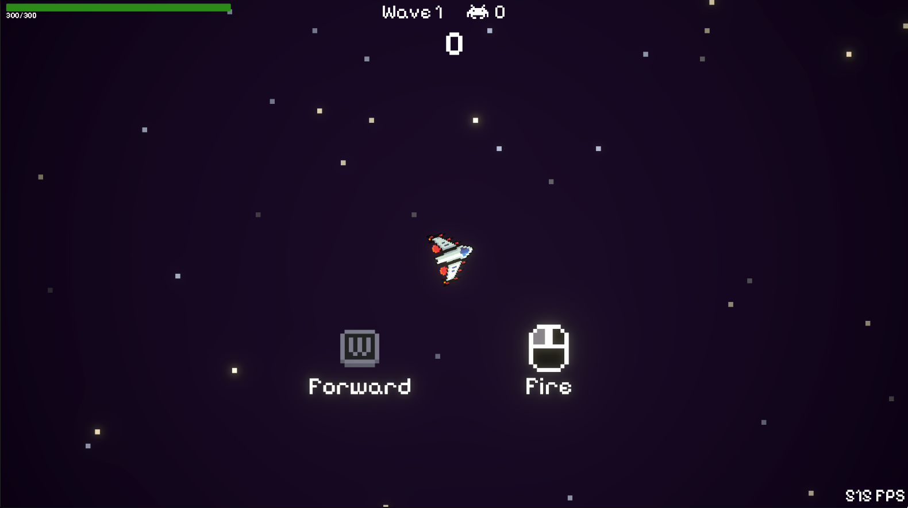
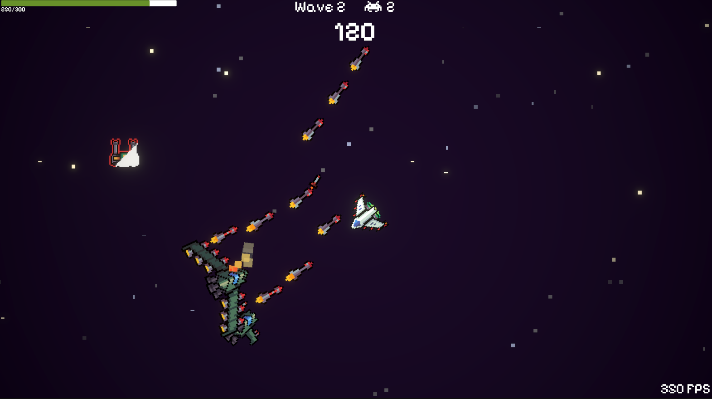
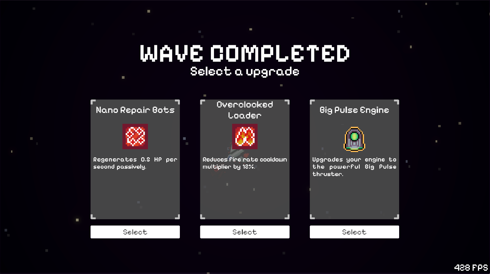
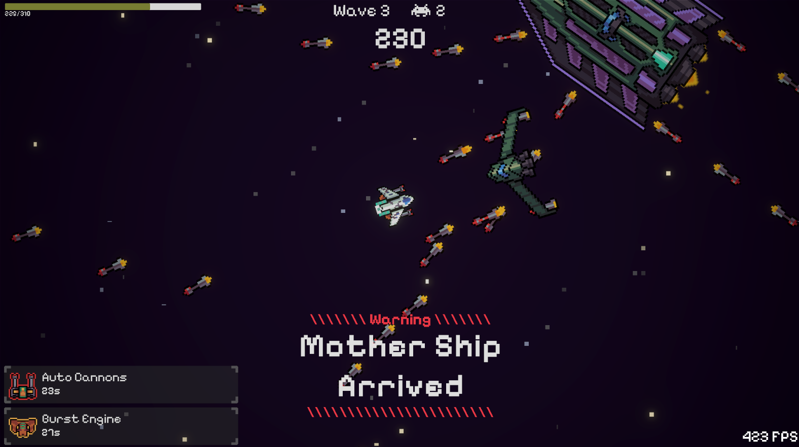
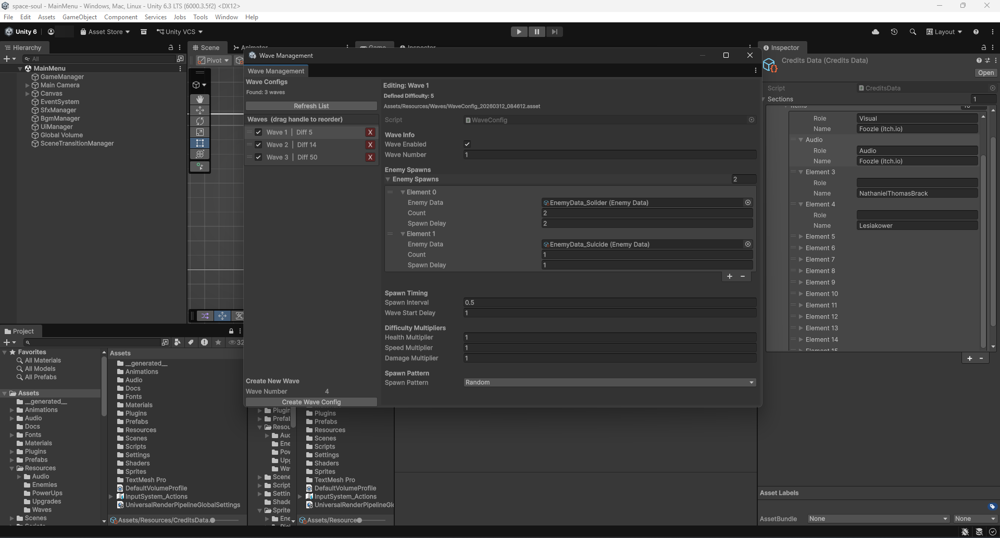

# Space Soul

Project starts on 27-01-2026

 &nbsp;&nbsp;&nbsp;

A 2D space vampire survivor style game built with Unity, featuring pixel art graphics. Players control a spaceship and battle against waves of enemies while collecting power-ups and upgrades.

Give me a ⭐ if you like it.

## 📖 Table of contents

- [✨ Features](#-features)
- [📸 Screenshots](#-screenshots)
  - [Gameplay](#gameplay)
  - [Editor Tools](#editor-tools)
- [🛠️ Development Environment](#️-development-environment)
- [🛠️ Editor Tools](#️-editor-tools)
- [📦 External Packages Used](#-external-packages-used)
- [🌟 Credits](#-credits)
- [📝 License](#-license)
- [☕ Sponsorship](#-sponsorship)

## ✨ Features

- **Customizable Waves:** Easily configure and design enemy waves and their difficulty.
- **Unlimited Waves:** The game seamlessly generates endless waves once players progress beyond the pre-defined waves.
- **Temporary Power-Ups:** Enemies have a chance to drop temporary, game-changing power-ups when defeated.
- **Permanent Upgrades:** Choose from a selection of permanent ship upgrades at the end of each wave to form your ideal build.

## 📸 Screenshots

### Gameplay

|  Main Menu |  Options Menu |
| --- | --- |
|  In-Game 1 |  In-Game 2 |
|  In-Game 3 |  In-Game 4 |

### Editor Tools

#### Wave Management Window

## 🛠️ Development Environment

- **Game Engine:** Unity 6000.3.5f2
- **Operating System:** Windows 11
- **IDE:** Visual Studio 2026
- **AI Assistance:** GPT-3.5-Codex

## 🛠️ Editor Tools

This project includes custom Unity Editor tools to streamline the development process, located in `Assets/Scripts/Editor`:

- **Wave Management Window** (`Tools > Wave Management`): A centralized editor interface for managing `WaveConfig` assets. It allows you to easily view, reorder, delete, and balance wave difficulties all from one window. Reordering automatically updates wave numbers.
- **Scene Enum Generator** (`Tools > Code Generation > Generate Scene Enum`): Built-in tool that automatically generates a strongly-typed `SceneId` enum based on the scenes added to the Build Settings. It ensures safe scene loading without relying on hardcoded strings.
- **Tag Enum Generator** (`Tools > Code Generation > Generate Tag Enum`): Automatically generates a `TagId` enum from the project's tags. It includes robust extension methods like `gameObject.Matches(TagId.Player)` to safely compare and manage Unity tags.

> [!NOTE]\
> All generated code is placed in `Assets/__generated__` and is automatically updated whenever you run the generation tools.

## 📦 External Packages Used

This project relies on the following non-Unity-built-in packages to function:

- **[DOTween](http://dotween.demigiant.com/)**: Used for smooth UI animations, tweening effects, and visual polish.
- **[Cinemachine](https://unity.com/unity/features/editor/art-and-design/cinemachine)**: Used to follow the player.

## 🌟 Credits

Thanks to the following creators for their contributions to this project:

**Visuals**

- Assets by [Foozle](https://foozlecc.itch.io/): [Void Environment Pack](https://foozlecc.itch.io/void-environment-pack), [Void Main Ship](https://foozlecc.itch.io/void-main-ship), [Void Fleet Pack 2](https://foozlecc.itch.io/void-fleet-pack-2), [Void Pickups Pack](https://foozlecc.itch.io/void-pickups-pack), [Lucifer RPG UI](https://foozlecc.itch.io/lucifer-rpg-ui)

**Fonts**

- [Pixelify Sans](https://fonts.google.com/specimen/Pixelify+Sans) by [*eifetx*](https://github.com/eifetx)

**Audio**

- Music by [Foozle](https://foozlecc.itch.io/): [Eerie Space Music](https://foozlecc.itch.io/eerie-space-music) and [NathanielThomasBrack](https://pixabay.com/users/nathanielthomasbrack-189494/): [8-bit Loop](https://pixabay.com/sound-effects/musical-8-bit-loop-189494/)
- Sound Effects from Pixabay:
  - [Power up](https://pixabay.com/sound-effects/film-special-effects-experimental-8-bit-sound-270302/) *(no author name)*
  - [Wave complete](https://pixabay.com/sound-effects/film-special-effects-level-up-enhancement-8-bit-retro-sound-effect-153002/), [Button Click](https://pixabay.com/sound-effects/film-special-effects-minimalist-button-hover-sound-effect-399749/) by *Lesiakower*
  - [Enemy explosion](https://pixabay.com/sound-effects/musical-kick-hard-8-bit-103746/) by *Self distrust / DewAholic*
  - [Projectile explosion](https://pixabay.com/sound-effects/film-special-effects-pixel-explosion-319166/) by *Lumora_Studios*
  - [Engine ray](https://pixabay.com/sound-effects/film-special-effects-sci-fi-spaceship-engine-idle-95668/) by *SRJA_Gaming*
  - [Engine fire](https://pixabay.com/sound-effects/film-special-effects-spaceship-ambient-sfx-164114/) by *JCI21*
  - [Weapon zap](https://pixabay.com/sound-effects/film-special-effects-electric-spark-404229/) by *Virtual_Vibes*
  - [Weapon super space gun](https://pixabay.com/sound-effects/film-special-effects-laser-45816/) by *Kronos1001*
  - [Weapon cannon](https://pixabay.com/sound-effects/film-special-effects-powerful-cannon-shot-352459/) by *Universfield*
  - [Weapon rocket](https://pixabay.com/sound-effects/film-special-effects-bow-release-85040/) by *PorkMuncher*
  - [Projectile hit](https://pixabay.com/sound-effects/film-special-effects-hitting-metal-31859/) by *APallot*
  - [Alarm](https://pixabay.com/sound-effects/film-special-effects-alarm-301729/) by *8footdino_on_scratch*

## 📝 License

This project is licensed under the GPL-3.0 License - see the [LICENSE](LICENSE) file for details

## ☕ Sponsorship

Love it? Consider a sponsorship to support my work.

 <- click me~
